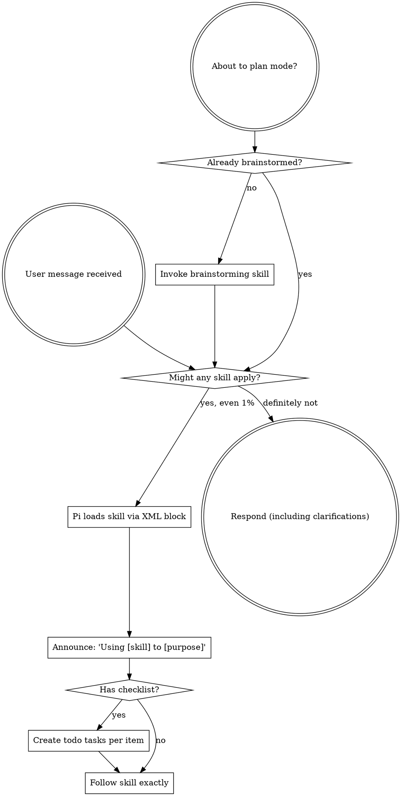

# Migrate `using-superpowers` to Pi Implementation Plan

> **For agentic workers:** REQUIRED SUB-SKILL: Use `subagent-driven-development` (recommended) or `executing-plans` to implement this plan task-by-task. Steps use checkbox (`- [ ]`) syntax for tracking.

**Goal:** Create `pi-skills/using-superpowers/` as a Pi-native meta-skill and update `migrate-superpower` documentation to reflect the migrated status.

**Architecture:** Port the Superpowers meta-skill by keeping its core discipline (skill-first hard gate, instruction priority, Red Flags) while replacing all platform-specific invocation instructions with Pi's XML `<skill>` block mechanism. Remove non-Pi reference files and add a Pi tool quick-reference.

**Tech Stack:** Markdown, bash verification, `./install.sh` deployment.

---

## File Structure

| File | Responsibility |
|---|---|
| `pi-skills/using-superpowers/SKILL.md` | Pi-native meta-skill: rules for discovering and invoking skills before every response. |
| `pi-skills/using-superpowers/references/pi-tools.md` | Quick-reference for Pi tools available to skills. |
| `pi-skills/skills/migrate-superpower/SKILL.md` | Update migration status table, add no-SHA rationale, tool differences, verification commands, pitfalls, checklist, and local customization record. |
| `pi-skills/skills/migrate-superpower/skill-mapping.md` | Update `using-superpowers` status to `✅ Migrated (no SHA)`. |
| `pi-skills/skills/migrate-superpower/skill-sha.json` | Leave unchanged — `using-superpowers` is excluded from SHA tracking. |

---

### Task 1: Create `pi-skills/using-superpowers/SKILL.md`

**Files:**
- Create: `pi-skills/using-superpowers/SKILL.md`

- [ ] **Step 1: Write the SKILL.md content**

Create the file with the following content:

```markdown
---
name: using-superpowers
description: Use when starting any conversation - establishes how to find and invoke Pi skills, requiring skill invocation before ANY response including clarifying questions
---

<SUBAGENT-STOP>
If you were dispatched as a subagent to execute a specific task, skip this skill.
</SUBAGENT-STOP>

<EXTREMELY-IMPORTANT>
If you think there is even a 1% chance a skill might apply to what you are doing, you ABSOLUTELY MUST invoke the skill.

IF A SKILL APPLIES TO YOUR TASK, YOU DO NOT HAVE A CHOICE. YOU MUST USE IT.

This is not negotiable. This is not optional. You cannot rationalize your way out of this.
</EXTREMELY-IMPORTANT>

## Instruction Priority

Pi skills override default system prompt behavior, but **user instructions always take precedence**:

1. **User's explicit instructions** (`AGENTS.md`, `.rpiv/guidance/`, direct requests) — highest priority
2. **Pi skills** — override default system behavior where they conflict
3. **Default system prompt** — lowest priority

If `AGENTS.md` says "don't use TDD" and a skill says "always use TDD," follow the user's instructions. The user is in control.

## How to Access Skills

Pi loads skills via an XML block injected into the conversation context. The system discovers skills from `~/.pi/agent/skills/` and project-level `.pi/skills/` directories.

When a skill applies, it is loaded like this:

```xml
<skill name="brainstorming" location="/Users/lychee/.pi/agent/skills/brainstorming/SKILL.md">
  <!-- skill body -->
</skill>
```

Follow the loaded skill directly. Do not use the `read` tool on skill files.

## Pi Tool Mapping (Concise)

A full quick-reference is available in `references/pi-tools.md`.

| Tool | Purpose |
|---|---|
| `read` / `write` / `edit` | File operations |
| `bash` | Run shell commands |
| `todo` | Track multi-step tasks |
| `ask_user_question` | Structured user questions |
| `subagent` / `get_subagent_result` / `steer_subagent` | Typed subagent dispatch |
| `web_search` / `web_fetch` | Web research |
| `visual_companion_*` | Browser-based visual companion |
| `mcp` | MCP gateway |

# Using Skills

## The Rule

**Invoke relevant or requested skills BEFORE any response or action.** Even a 1% chance a skill might apply means that you should invoke the skill to check. If an invoked skill turns out to be wrong for the situation, you don't need to use it.



## Red Flags

These thoughts mean STOP — you're rationalizing:

| Thought | Reality |
|---|---|
| "This is just a simple question" | Questions are tasks. Check for skills. |
| "I need more context first" | Skill check comes BEFORE clarifying questions. |
| "Let me explore the codebase first" | Skills tell you HOW to explore. Check first. |
| "I can check git/files quickly" | Files lack conversation context. Check for skills. |
| "Let me gather information first" | Skills tell you HOW to gather information. |
| "This doesn't need a formal skill" | If a skill exists, use it. |
| "I remember this skill" | Skills evolve. Read current version. |
| "This doesn't count as a task" | Action = task. Check for skills. |
| "The skill is overkill" | Simple things become complex. Use it. |
| "I'll just do this one thing first" | Check BEFORE doing anything. |
| "This feels productive" | Undisciplined action wastes time. Skills prevent this. |
| "I know what that means" | Knowing the concept ≠ using the skill. Invoke it. |

## Skill Priority

When multiple skills could apply, use this order:

1. **Process skills first** (brainstorming, debugging) - these determine HOW to approach the task
2. **Implementation skills second** (frontend-design, mcp-builder) - these guide execution

"Let's build X" → brainstorming first, then implementation skills.
"Fix this bug" → debugging first, then domain-specific skills.

## Skill Types

**Rigid** (TDD, debugging): Follow exactly. Don't adapt away discipline.

**Flexible** (patterns): Adapt principles to context.

The skill itself tells you which.

## User Instructions

Instructions say WHAT, not HOW. "Add X" or "Fix Y" doesn't mean skip workflows.
```

- [ ] **Step 2: Verify the file exists and has valid frontmatter**

Run:
```bash
cd /Users/lychee/Documents/configure
head -n 5 pi-skills/using-superpowers/SKILL.md
```

Expected output:
```yaml
---
name: using-superpowers
description: Use when starting any conversation - establishes how to find and invoke Pi skills, requiring skill invocation before ANY response including clarifying questions
---
```

- [ ] **Step 3: Commit the new file**

```bash
cd /Users/lychee/Documents/configure
git add pi-skills/using-superpowers/SKILL.md
git commit -m "feat(pi-skills): add using-superpowers meta skill for Pi"
```

---

### Task 2: Create `pi-skills/using-superpowers/references/pi-tools.md`

**Files:**
- Create: `pi-skills/using-superpowers/references/pi-tools.md`

- [ ] **Step 1: Write the pi-tools.md content**

Create the file with the following content:

```markdown
# Pi Tool Quick Reference

A concise reference for tools available when executing Pi skills.

## Skill Invocation

Pi loads skills via XML block, not a tool call:

```xml
<skill name="brainstorming" location="/Users/lychee/.pi/agent/skills/brainstorming/SKILL.md">
  <!-- skill body -->
</skill>
```

## Core File Tools

| Tool | Purpose |
|---|---|
| `read` | Read text files and images |
| `write` | Create or overwrite files |
| `edit` | Targeted text replacement |
| `find` | Search files by glob pattern |
| `ls` | List directory contents |

## Execution & Shell

| Tool | Purpose |
|---|---|
| `bash` | Run shell commands with optional timeout |

## Task & Workflow

| Tool | Purpose |
|---|---|
| `todo` | Create, update, list, and track tasks |

## User Interaction

| Tool | Purpose |
|---|---|
| `ask_user_question` | Structured single-select or multi-select questions |

## Subagents

| Tool | Purpose |
|---|---|
| `subagent` | Dispatch a typed subagent |
| `get_subagent_result` | Check status or retrieve subagent results |
| `steer_subagent` | Send a mid-run message to a subagent |

## Research

| Tool | Purpose |
|---|---|
| `web_search` | Search the open web |
| `web_fetch` | Fetch and read a specific URL |

## Visual Companion

| Tool | Purpose |
|---|---|
| `visual_companion_start` | Start a browser session |
| `visual_companion_show` | Push an HTML screen to the browser |
| `visual_companion_wait` | Block until the user confirms |
| `visual_companion_read_events` | Read browser interaction events |
| `visual_companion_stop` | Stop the browser session |

## MCP Gateway

| Tool | Purpose |
|---|---|
| `mcp` | Connect to MCP servers and call their tools |
```

- [ ] **Step 2: Verify the file exists and contains no platform-specific references**

Run:
```bash
cd /Users/lychee/Documents/configure
grep -Ei "Claude Code|Copilot CLI|Gemini CLI|Codex|superpowers" pi-skills/using-superpowers/references/pi-tools.md || echo "OK: no external platform refs"
grep -Ei "Skill tool|activate_skill" pi-skills/using-superpowers/references/pi-tools.md || echo "OK: no old invocation refs"
```

Expected: both lines print `OK`.

- [ ] **Step 3: Commit the new file**

```bash
cd /Users/lychee/Documents/configure
git add pi-skills/using-superpowers/references/pi-tools.md
git commit -m "feat(pi-skills): add pi-tools reference for using-superpowers"
```

---

### Task 3: Update `pi-skills/skills/migrate-superpower/SKILL.md`

**Files:**
- Modify: `pi-skills/skills/migrate-superpower/SKILL.md`

- [ ] **Step 1: Update §3 Skill Name Mappings table**

Locate the row:

```markdown
| `using-superpowers` | 🚫 Skip | Platform-specific to Superpowers; do not migrate. |
```

Replace it with:

```markdown
| `using-superpowers` | ✅ Migrated (no SHA) | Migrated as Pi-native meta skill. Removed platform-specific references for Claude Code / Copilot CLI / Gemini CLI / Codex. Kept only `references/pi-tools.md`. |
```

- [ ] **Step 2: Update §3.1 No-SHA Tracking**

Append a paragraph after the existing examples:

```markdown
`using-superpowers` also falls into this category. The upstream skill describes how to invoke skills across the Superpowers ecosystem (Claude Code, Copilot CLI, Gemini CLI, Codex). The Pi version is a complete rewrite focused solely on Pi's XML skill block and native tools, so upstream changes cannot be mechanically merged.
```

- [ ] **Step 3: Add Skill Invocation Difference subsection to §4 Tool & API Differences**

Insert after the existing `Agent / Subagent` section:

```markdown
### Skill Invocation

Superpowers skills are invoked through platform-specific tools:

- Claude Code: `Skill` tool
- Copilot CLI: `skill` tool
- Gemini CLI: `activate_skill` tool

Pi does not use a tool to invoke skills. Instead, Pi loads skills via an XML block injected into the conversation context:

```xml
<skill name="brainstorming" location="/Users/lychee/.pi/agent/skills/brainstorming/SKILL.md">
  <!-- skill body -->
</skill>
```

When migrating skills that say "invoke the X skill" or "use the Skill tool," update the prose to describe Pi's XML block loading mechanism. Do not refer to a "Skill tool" in Pi.
```

- [ ] **Step 4: Add Platform-Specific Meta Skills subsection to §7 Documentation Content**

Insert after the `HTML / Template IDs` subsection:

```markdown
### Platform-Specific Meta Skills

Some Superpowers skills (notably `using-superpowers`) are primarily about how to use the Superpowers platform itself. When migrating these:

- Delete instructions for other platforms (Claude Code, Copilot CLI, Gemini CLI, Codex)
- Replace them with Pi's skill-loading mechanism (XML `<skill>` block)
- Keep the core discipline rules: skill-first hard gate, instruction priority, Red Flags, skill priority, skill types
- Replace platform-specific tool reference files with Pi-only references
- Do not keep `codex-tools.md`, `copilot-tools.md`, or `gemini-tools.md` unless the skill genuinely needs them
```

- [ ] **Step 5: Update §8 Verification Commands**

Append after the existing checks:

```bash
# Check for remaining platform-specific meta-skill references
grep -ri "Claude Code\|Copilot CLI\|Gemini CLI\|Codex" pi-skills/using-superpowers/ || echo "OK: no external platform refs"
grep -ri "Skill tool\|activate_skill\|skill tool" pi-skills/using-superpowers/ || echo "OK: no old skill invocation refs"
```

- [ ] **Step 6: Add pitfalls to §9 Common Pitfalls**

Append three new items:

```markdown
- **Meta skills need full rewrite, not string replacement.** A skill like `using-superpowers` describes platform behavior. Migrating it requires rethinking the content for Pi, not just replacing brand names.
- **Delete other-platform reference files, don't rename them.** `references/codex-tools.md` should be removed, not renamed to `pi-tools.md`. Create a fresh `pi-tools.md` with Pi content.
- **Skill invocation is not a tool in Pi.** Avoid phrases like "use the Skill tool" or "call activate_skill". Pi loads skills via XML block.
```

- [ ] **Step 7: Update §10 Post-Migration Checklist**

Add these items to the checklist:

```markdown
- [ ] No references to Claude Code / Copilot CLI / Gemini CLI / Codex remain
- [ ] Skill invocation is described as XML `<skill>` block, not a tool
- [ ] Only Pi-specific tool reference files remain in `references/`
- [ ] Meta skill still enforces the skill-first hard gate
```

- [ ] **Step 8: Add `using-superpowers` to §10.5 Local Customization Record**

Append a new subsection:

```markdown
### `using-superpowers`

**Upstream SHA:** Not tracked

**Local modification summary (relative to upstream):**

| Change | Upstream | Local |
|---|---|---|
| **Platform scope** | Describes Claude Code, Copilot CLI, Gemini CLI, Codex skill invocation | Describes only Pi skill invocation |
| **Invocation mechanism** | `Skill` / `skill` / `activate_skill` tools | XML `<skill>` block |
| **Reference files** | `codex-tools.md`, `copilot-tools.md`, `gemini-tools.md` | Only `references/pi-tools.md` |
| **DOT flowchart** | Centers on "Invoke Skill tool" | Centers on "Pi loads skill via XML block" |
| **Red Flags / priority** | Generic discipline rules | Rewritten for Pi context |

**Re-migration steps:**

1. Do not rely on SHA diffing; the Pi version is a complete rewrite.
2. If upstream `using-superpowers` changes significantly, re-evaluate whether Pi's meta-skill rules need updating rather than blindly porting.
3. Apply any genuinely new discipline concepts from upstream to the Pi rewrite.
4. Update this local customization record if the scope changes.
```

- [ ] **Step 9: Verify changes and commit**

Run:
```bash
cd /Users/lychee/Documents/configure
grep -n "using-superpowers" pi-skills/skills/migrate-superpower/SKILL.md | head -n 10
```

Expected: see the updated status row and at least one customization section reference.

Commit:
```bash
cd /Users/lychee/Documents/configure
git add pi-skills/skills/migrate-superpower/SKILL.md
git commit -m "docs(migrate-superpower): update using-superpowers migration status and guidance"
```

---

### Task 4: Update `pi-skills/skills/migrate-superpower/skill-mapping.md`

**Files:**
- Modify: `pi-skills/skills/migrate-superpower/skill-mapping.md`

- [ ] **Step 1: Update the migration table row**

Locate:

```markdown
| — | `using-superpowers` | 🚫 Skip | Entirely about the Superpowers platform itself. Not applicable to Pi. |
```

Replace with:

```markdown
| 14 | `using-superpowers` | ✅ Migrated (no SHA) | Migrated as Pi-native meta skill. Removed platform-specific references. Kept only `references/pi-tools.md`. |
```

- [ ] **Step 2: Verify and commit**

Run:
```bash
cd /Users/lychee/Documents/configure
grep -n "using-superpowers" pi-skills/skills/migrate-superpower/skill-mapping.md
```

Expected: see the updated row with `✅ Migrated (no SHA)`.

Commit:
```bash
cd /Users/lychee/Documents/configure
git add pi-skills/skills/migrate-superpower/skill-mapping.md
git commit -m "docs(migrate-superpower): update using-superpowers status in mapping"
```

---

### Task 5: Verify No External References Remain

**Files:**
- Read: `pi-skills/using-superpowers/SKILL.md`
- Read: `pi-skills/using-superpowers/references/pi-tools.md`

- [ ] **Step 1: Run verification commands**

```bash
cd /Users/lychee/Documents/configure
echo "=== external platform refs ==="
grep -riE "Claude Code|Copilot CLI|Gemini CLI|Codex|superpowers" pi-skills/using-superpowers/ || echo "OK"
echo "=== old invocation refs ==="
grep -riE "Skill tool|activate_skill" pi-skills/using-superpowers/ || echo "OK"
echo "=== old paths ==="
grep -riE "\.superpowers|docs/superpowers" pi-skills/using-superpowers/ || echo "OK"
```

Expected: all three checks print `OK`.

- [ ] **Step 2: Manual spot-check for brand names**

Open `pi-skills/using-superpowers/SKILL.md` and confirm:
- The word "Superpowers" does not appear except in the skill name `using-superpowers`.
- "Claude", "Copilot", "Gemini", "Codex" do not appear.
- Skill invocation is described via XML block.

- [ ] **Step 3: Commit any fixes**

If any check fails, fix the issue and commit. If all pass, no commit needed in this task.

---

### Task 6: Deploy and Validate

**Files:**
- Execute: `./install.sh`

- [ ] **Step 1: Run install script**

```bash
cd /Users/lychee/Documents/configure
./install.sh
```

Expected: script completes without errors and deploys skills to `~/.pi/agent/skills/`.

- [ ] **Step 2: Verify deployed files exist**

```bash
ls -la ~/.pi/agent/skills/using-superpowers/
ls -la ~/.pi/agent/skills/using-superpowers/references/
ls -la ~/.pi/agent/skills/migrate-superpower/
```

Expected:
- `~/.pi/agent/skills/using-superpowers/SKILL.md` exists
- `~/.pi/agent/skills/using-superpowers/references/pi-tools.md` exists
- `~/.pi/agent/skills/using-superpowers/references/` does NOT contain `codex-tools.md`, `copilot-tools.md`, or `gemini-tools.md`
- `~/.pi/agent/skills/migrate-superpower/SKILL.md` and `skill-mapping.md` are updated

- [ ] **Step 3: Reload Pi**

In Pi, run:
```
/reload
```

Then verify `using-superpowers` appears in the available skills list.

- [ ] **Step 4: Final commit if deploy changed anything**

If `./install.sh` modified tracked files (e.g., deployment manifests), commit them. Typically it copies files to `~/.pi/agent/skills/` which is outside the repo, so no additional commit is needed.

---

## Self-Review Checklist

- [ ] Spec coverage: every design section has corresponding tasks.
- [ ] No placeholders: all tasks include exact file paths and content.
- [ ] Type consistency: N/A (Markdown docs).
- [ ] `skill-sha.json` is intentionally left unchanged.
