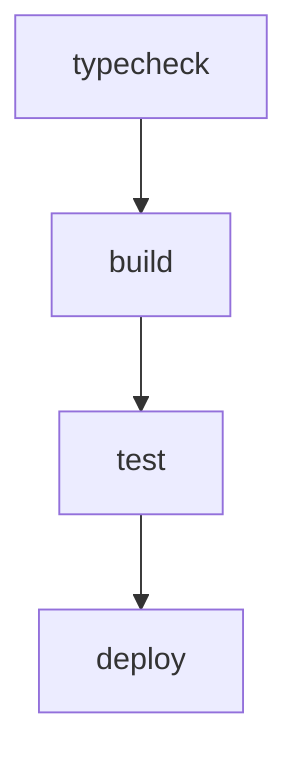

# configure 项目规格文档

> 状态：已确认，可作为实现基准
> 确认日期：2026-07-10
> 需求文档：[REQUIREMENTS.md](./REQUIREMENTS.md)

## 1. 设计目标

本项目是 Pi Coding Agent 的个人配置仓库，目标是在单一仓库中管理：

- 自定义 Pi 扩展（业务工具、TUI 增强、生命周期反馈）。
- 自定义技能（LLM 行为模板）。
- 自定义主题（TUI 视觉样式）。
- 子代理定义、MCP 配置、Pi 设置。
- 终端与 Shell 配置（Starship、WezTerm）。

核心约束：**每个 Pi 扩展都必须是可独立构建、测试、部署的 workspace；全局需求文档同步优先于代码改动。**

## 2. Monorepo 结构

```
configure/
├── pi-extensions/           # Bun workspaces，每个扩展一个目录
│   ├── my-back/
│   ├── my-bt/
│   ├── my-html/
│   ├── my-hud/
├── pi-skills/               # 自定义技能文件
├── pi-themes/               # 主题 JSON + 部署脚本
├── pi-agents/               # 子代理定义（PR 审查角色）
├── pi-config/               # 纯配置 JSON 扩展
├── mcp/                     # MCP 服务器配置
├── settings/                # Pi 设置 JSON
├── turbo.json               # Turborepo 流水线
├── package.json             # workspaces + 脚本
├── install.sh               # 一键部署
├── README.md                # 项目总览
├── AGENTS.md                # 仓库开发指南
├── MY-AGENTS.md             # 全局 Agent 偏好
├── REQUIREMENTS.md          # 项目级需求索引
└── SPEC.md                  # 本文件
```

## 3. Workspace 规范

### 3.1 pi-extensions

每个扩展目录必须包含：

- `index.ts`：扩展入口，注册事件、命令、工具、widget。
- `package.json`：声明 `name`、`scripts`（`build`/`test`/`deploy`/`typecheck`）、依赖。
- `tsconfig.json`：TypeScript 配置。
- `vitest.config.ts`：测试配置（含 v8 覆盖率）。
- `REQUIREMENTS.md`：功能 / 非功能 / 验收 / 排除项清单。
- `SPEC.md`：模块结构、接口、数据流、测试策略、变更日志。
- `my-xxx.json`：与扩展目录同级的 JSON 配置（如需要）。

可选文件：

- `types.ts`：共享类型。
- `scripts/deploy.ts`：自定义部署逻辑。
- `README.md`：面向用户的使用说明。

### 3.2 pi-config

纯配置扩展目录，只包含 JSON 文件，不编译 TypeScript。当前包含：

- `pi-permission-system.json`：权限规则。
- `pi-tool-display.json`：工具显示与 diff 风格。

### 3.3 pi-skills / pi-themes / pi-agents / mcp / settings

这些目录以静态配置或脚本为主，不强制要求 `REQUIREMENTS.md`/`SPEC.md`；复杂子组件可独立补充。`settings` 仅维护 `settings.json`；当前使用的 Kimi 模型全部由 Pi 内置目录提供。

子代理运行时使用 `npm:pi-subagents`。通用角色（scout、delegate、researcher、context-builder、planner、oracle、reviewer、worker）由 `pi-subagents` 官方包提供；`pi-agents/*.md` 只保留 PR 审查角色，部署到用户级 agent 目录，每个文件显式声明 `name`，使用 `systemPromptMode` 及 `inheritProjectContext` / `inheritSkills` 控制提示词组装。通用角色的模型和 fallback 由 `settings/settings.json` 的 `subagents.agentOverrides` 维护；本地 PR 审查角色文件显式声明其专用 `model`。agent frontmatter 只保留角色专属的工具、thinking 与提示词。只读但包含 `bash` 或扩展工具的角色显式设置 `acceptanceRole: read-only` 和 `completionGuard: false`，避免被实现完成度检查误判为 writer。

`pi-subagents` 与 `@gotgenes/pi-subagents` 都注册 `subagent`，因此不得并装。运行时包通过 `pi install` / `pi remove` 管理，不写入仓库的合并式 `settings/settings.json`，避免覆盖用户已有的其他包列表。`@gotgenes/pi-permission-system` 保留，并通过 `pi-subagents` 的父会话身份桥接对子进程执行权限检查。

`pi-skills/skills/` 只保存仓库自有技能，不迁移或镜像外部技能。当前目录固定为：

- `auditing-plan-implementation`
- `creating-pull-requests`
- `review-pr`
- `split-design-into-tickets`
- `web-search-researcher`
- `writing-plan-for-ticket`

外部技能不进入本仓库的技能部署目录；上游支持 Pi 原生安装时，由 Pi 包管理器在仓库外独立管理。

## 4. Turborepo 流水线



配置在 `turbo.json`：

| 任务        | 说明                                               | 依赖             |
| ----------- | -------------------------------------------------- | ---------------- |
| `typecheck` | TypeScript 类型检查                                | 无               |
| `build`     | 编译到 `dist/**`                                   | `^build`         |
| `test`      | Vitest 运行 + v8 覆盖率                            | `build`          |
| `deploy`    | 复制产物到 `~/.pi/agent/extensions/...` 或对应目录 | `test`（非缓存） |

## 5. 扩展架构模式

### 5.1 依赖方向

每个扩展的 `index.ts` 是唯一的副作用入口；纯逻辑模块单向依赖类型/工具模块：

```
index.ts
  ├── pure-module-1.ts
  ├── pure-module-2.ts
  └── types.ts
```

禁止循环依赖：纯函数模块不依赖 `index.ts`。

### 5.2 测试分层

| 测试类型       | 覆盖对象                                             | 示例                           |
| -------------- | ---------------------------------------------------- | ------------------------------ |
| 纯函数单元测试 | `validate.ts`、`format.ts`、`helper.ts`、`render.ts` | 校验错误码、格式化输出         |
| 状态机测试     | `state.ts`、`questionnaire.ts`                       | 任务 CRUD、问卷状态流转        |
| 系统探测测试   | `git.ts`、`pr.ts`、`memory.ts`                       | mock shell 输出                |
| 集成测试       | `index.ts`                                           | mock `ExtensionAPI`、事件、TUI |

### 5.3 覆盖率策略

- 目标：`branches / functions / lines / statements` 全部 100%。
- 排除：`types.ts`（纯类型）、`index.ts`（集成入口）、`RealGitAdapter`（execSync 壳）。
- 命令：`cd pi-extensions/my-xxx && npx vitest run --coverage` 或 `bunx turbo run test`。

## 6. 需求与代码同步流程

当需求发生变动时，必须按以下顺序执行：

1. 停止当前编码。
2. 更新 `REQUIREMENTS.md`（「要什么 / 不做什么」）。
3. 若影响模块职责或接口，更新 `SPEC.md`。
4. 请用户通读确认。
5. 确认后编写/更新测试，再实现代码。

该流程适用于所有包含 `REQUIREMENTS.md` 与 `SPEC.md` 的子目录。

## 7. 部署路径

### 7.1 Pi 扩展

构建产物 `dist/index.js` 通过 `bun run deploy` 复制到：

```
~/.pi/agent/extensions/
├── my-back/index.js
├── my-bt/index.js
├── my-html/index.js
├── my-hud/index.js
├── ...
```

### 7.2 技能、主题、设置、MCP

由 `install.sh` 或各 `deploy` 脚本分别复制到：

- `~/.pi/agent/skills/`
- `~/.pi/agent/themes/`
- `~/.pi/agent/agents/`
- `~/.pi/agent/settings.json`
- `~/.pi/agent/mcp.json`

`pi-skills/scripts/deploy.ts` 以仓库中的 `pi-skills/skills/` 为完整快照：部署前重建 `~/.pi/agent/skills/`，因此已从仓库删除的迁移技能不会残留在本机。

`pi-agents/scripts/deploy.ts` 将仓库中的 Markdown 定义同步到 `~/.pi/agent/agents/`。迁移验证通过 `pi-subagents` 的 agent list/doctor 接口确认本地 5 个 PR 审查 agent 定义及官方包通用角色均可解析，而不是只检查文件存在。

`settings/scripts/deploy.ts` 仅将仓库的 `settings.json` 递归合并到本机设置。仓库不部署 `models.json`，`kimi-coding/k3` 与 `kimi-coding/kimi-for-coding-highspeed` 直接使用 Pi 内置模型目录。本次清理不配置 `git:github.com/obra/superpowers`；若将来需要官方 Superpowers，应使用 Pi 包管理器单独安装。该脚本不管理 `packages` 数组；包迁移使用 `pi remove npm:@gotgenes/pi-subagents` 与 `pi install npm:pi-subagents`，防止数组合并覆盖其他用户包。

### 7.3 终端配置

通过符号链接方式安装：

```bash
ln -sf "$REPO/starship.toml" ~/.config/starship.toml
ln -sf "$REPO/wezterm.lua" ~/.wezterm.lua
ln -sf "$REPO/MY-AGENTS.md" ~/.pi/agent/AGENTS.md
ln -sf "$REPO/MY-AGENTS.md" ~/.claude/CLAUDE.md
```

## 8. 版本与变更管理

- 所有 `REQUIREMENTS.md` 与 `SPEC.md` 顶部必须包含状态与确认日期。
- 文档变更在文末 `变更日志` 中记录。
- 代码提交遵循约定式提交：`类型(范围): 描述`，全英文，祈使句，首字母小写，不加句号。

## 9. 不做什么

| 功能                                | 排除原因                                                                        |
| ----------------------------------- | ------------------------------------------------------------------------------- |
| 在仓库中提交敏感凭证                | 使用环境变量或外部配置文件注入                                                  |
| 为技能/主题/agent 写独立 SPEC 模块  | 当前复杂度较低，由本文件和目录入口说明统一覆盖                                  |
| 在 `pi-skills` 中迁移或镜像外部技能 | 避免重复维护；上游支持 Pi 时使用其原生安装方式                                  |
| 自维护 Visual Companion 扩展        | 使用官方 Superpowers 自带实现，避免重复维护 Pi 工具、WebSocket 服务与持久化目录 |
| 支持非 macOS 的音频/浮层            | 依赖 `afplay` / `osascript`                                                     |
| 跨网络访问本地服务                  | 所有 HTTP/WebSocket 服务器仅绑定 localhost                                      |

## 10. 变更日志

| 日期       | 变更                                                                                                                                      |
| ---------- | ----------------------------------------------------------------------------------------------------------------------------------------- |
| 2026-07-22 | 将子代理运行时切换为 `pi-subagents`，定义 agent frontmatter、模型配置、权限桥接与包管理边界                                               |
| 2026-07-22 | 移除本地 `pi-agents/` 中与 `pi-subagents` 官方包重复的 8 个通用角色，仅保留 5 个 PR 审查角色                                               |
| 2026-07-22 | 删除本地 Visual Companion workspace、部署副本、权限项与 `.lychee/visual-companion/` 运行产物                                              |
| 2026-07-22 | 将 `pi-skills` 收敛为 6 个仓库自有技能，删除迁移工具与外部技能副本，并明确快照部署清理旧副本                                              |
| 2026-07-21 | 移除 `models.json` 部署，Kimi K3 与 highspeed 统一使用 Pi 官方定义                                                                        |
| 2026-07-10 | 创建项目级 `SPEC.md`，定义 monorepo 结构、Turborepo 流水线、扩展架构与需求同步流程                                                        |
| 2026-07-10 | 修正 Monorepo 目录结构图：项目级 `README.md`、`REQUIREMENTS.md`、`SPEC.md`、`AGENTS.md`、`MY-AGENTS.md` 位于仓库根目录而非 `docs/` 子目录 |
