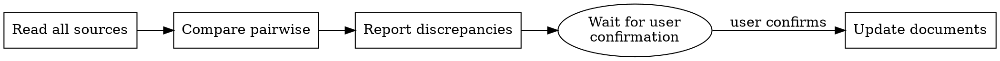

# Auditing Plan-Implementation Consistency

## Overview

Audit the implementation against the plan, ticket, and design **before** declaring consistency or changing any document.

**Core principle:** Report first, confirm second, update last. Never silently rewrite upstream documents to match code.

## When to Use

- User asks to audit implementation against plan, ticket, or design

## Core Pattern

### 1. Read All Sources

Read every relevant document:
- `ticket.md` / issue (what problem to solve)
- `design.md` / spec (how to solve it)
- `plan.md` / implementation plan (steps and acceptance criteria)
- Implementation files

### 2. Compare Pairwise

| Pair | Question |
|------|----------|
| Ticket ↔ Design | Does design solve the ticket? Any missing requirements? |
| Design ↔ Plan | Does plan cover all design decisions? |
| Plan ↔ Implementation | Does code follow every plan step? |
| Ticket ↔ Implementation | Does code satisfy the original requirements? |
| Design ↔ Implementation | Does code match the chosen architecture? |

### 3. Report Discrepancies First

List every discrepancy with evidence: quote the document, quote the implementation, and state what is missing, extra, or different. **Never report only "inconsistent."**

### 4. Wait for Confirmation Before Updating

Ask the user which source is the source of truth, whether code or documents should change, and which documents to update. **Do not update any document until the user confirms.**

### 5. Update Documents Only After Confirmation

Update only approved documents, preserve the intent of the ticket, and mark clearly what changed and why.

## Quick Reference

| Situation | Do this |
|-----------|---------|
| Code matches plan but plan omits ticket requirement | Flag ticket ↔ plan gap; do not silently add to plan |
| Code deviates from plan for good reason | Report deviation, propose plan update, wait for confirmation |
| User says "just update the docs to match code" | Report discrepancies first, then ask which docs and which changes |
| Documents contradict each other | List contradictions, ask user to pick source of truth |
| Everything aligns | State what sources were checked and that they align |

## Red Flags - STOP and Report

- User asks you to "just make the docs match the code"
- You are tempted to edit ticket/design/plan before reporting discrepancies
- You are about to delete requirements because they are not implemented
- You feel pressured to say "consistent" without checking all four sources

**All of these mean: stop, report the discrepancies, and wait for confirmation.**
